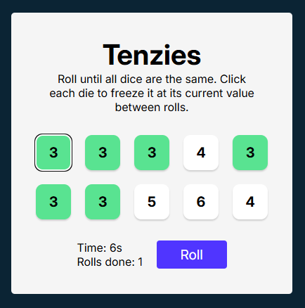
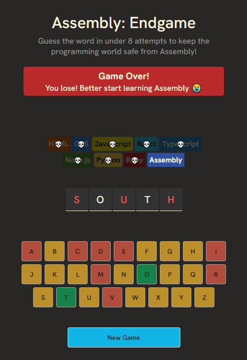

# React Practice Projects

A small collection of projects I've built while learning React. Currently holds:

## Tenzies

A small React game where you try to get all the dice to be the same number. The player can hold a die by clicking on it.

## Assembly Endgame

A modified version of the hangman game where the user guesses the word.

